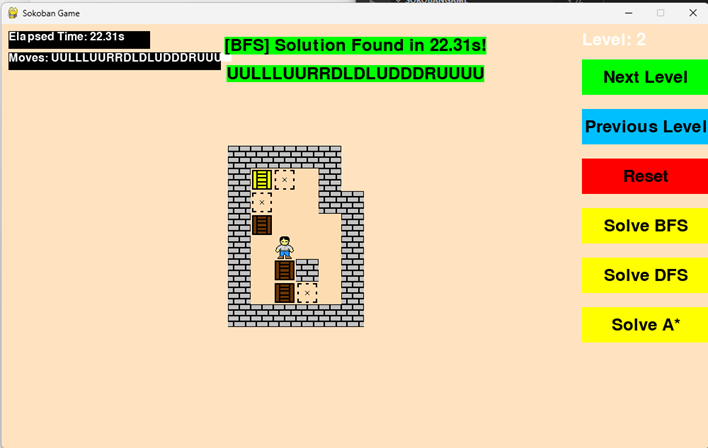
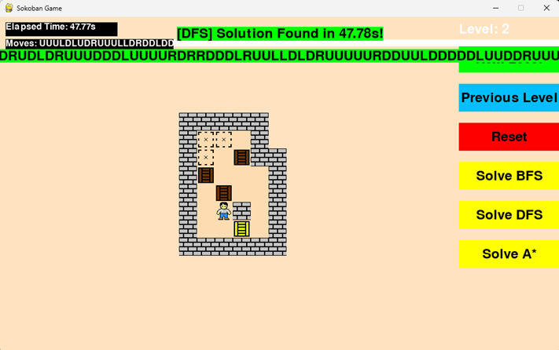
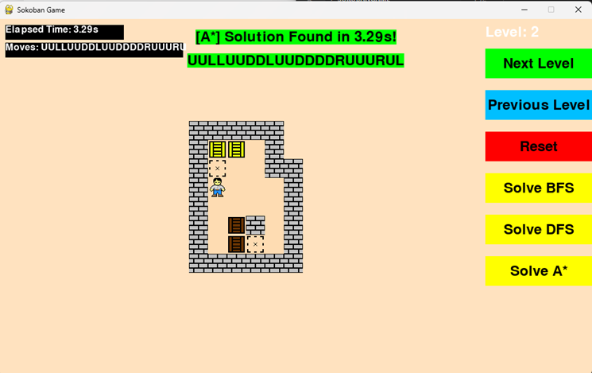

Here's a description for your Sokoban project that you can use on GitHub:

---

**Sokoban Game with AI Solver**

This project is a Python implementation of the classic puzzle game Sokoban, featuring an AI solver that uses BFS, DFS, and A* algorithms. The goal of the game is to push boxes to designated goal positions in a warehouse, avoiding deadlock and solving levels efficiently.

**Features:**
- Play the Sokoban game with multiple levels.
- Solve puzzles manually or use the built-in AI solver.
- The solver can handle three different algorithms:
  - **Breadth-First Search (BFS)**
  - **Depth-First Search (DFS)**
  - **A* Search**
- Deadlock detection to avoid unsolvable moves.
- Reset, solve, and navigate between levels using a clean GUI.

**Technologies Used:**
- **Python** with **Pygame** for GUI
- **Custom Solver** using BFS, DFS, and A* for automated play
- **Deadlock detection** for efficient solving

**How to Play:**
1. Run the game using Python.
2. Use the arrow keys to move the character and push boxes to their goals.
3. Alternatively, choose "Solve BFS", "Solve DFS", or "Solve A*" to let the AI solve the level for you.
4. Use the "Reset" button to start the level over.

**Screenshots:**
- Include some in-game screenshots showing different levels or AI solving a level.




**Installation Instructions:**
1. Clone the repository:
   ```sh
   git clone https://github.com/username/SokobanGame.git
   ```
2. Install the dependencies:
   ```sh
   pip install -r requirements.txt
   ```
3. Run the game:
   ```sh
   python sokoban.py
   ```

Feel free to contribute to this project by submitting a pull request or suggesting new features!

---

You can modify it to fit your style or add more details about the development process. Let me know if you'd like more specific sections or edits!
